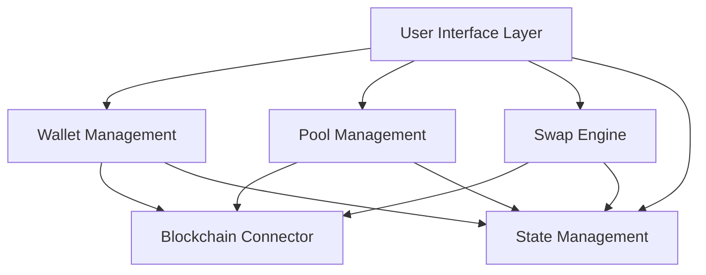

# Web3 DEX Frontend Design Document

## Overview

The Web3 DEX Frontend is a comprehensive decentralized exchange application built with modern web technologies and Web3 integration. The application provides a seamless user experience for connecting wallets, managing liquidity pools, and executing token swaps. The architecture emphasizes modularity, real-time updates, and robust error handling to ensure reliable operation in the decentralized finance ecosystem.

## Architecture

### High-Level Architecture



### Technology Stack

- **Frontend Framework**: React 18 with TypeScript for type safety and modern development
- **Web3 Integration**: Wagmi + Viem for Ethereum interactions and wallet connections
- **State Management**: Zustand for lightweight, scalable state management
- **UI Framework**: Tailwind CSS with Headless UI components for consistent design
- **Build Tool**: Vite for fast development and optimized production builds
- **Wallet Integration**: WalletConnect v2 and injected wallet support (MetaMask, etc.)

### Core Principles

1. **Modular Design**: Each major feature (wallet, pools, swaps) is implemented as independent modules
2. **Real-time Updates**: Blockchain state changes are reflected immediately in the UI
3. **Progressive Enhancement**: Core functionality works without advanced features
4. **Error Resilience**: Comprehensive error handling with user-friendly messaging
5. **Performance Optimization**: Efficient state updates and minimal re-renders

## Components and Interfaces

### Wallet Management Module

**WalletConnector Component**
- Handles multiple wallet provider detection and connection
- Manages wallet state persistence across sessions
- Provides wallet switching and disconnection functionality

**Key Interfaces:**
```typescript
interface WalletState {
  address: string | null;
  isConnected: boolean;
  chainId: number;
  balance: bigint;
}

interface WalletActions {
  connect: (walletType: WalletType) => Promise<void>;
  disconnect: () => void;
  switchChain: (chainId: number) => Promise<void>;
}
```

### Pool Management Module

**PoolCreator Component**
- Token selection interface with search and validation
- Liquidity amount inputs with balance checking
- Pool creation transaction flow with progress tracking

**PoolList Component**
- Displays all available pools with key metrics
- Real-time updates of pool statistics
- Filtering and sorting capabilities

**Key Interfaces:**
```typescript
interface Pool {
  id: string;
  tokenA: Token;
  tokenB: Token;
  reserveA: bigint;
  reserveB: bigint;
  totalLiquidity: bigint;
  volume24h: bigint;
  fees24h: bigint;
}

interface PoolActions {
  createPool: (tokenA: Token, tokenB: Token, amountA: bigint, amountB: bigint) => Promise<string>;
  addLiquidity: (poolId: string, amountA: bigint, amountB: bigint) => Promise<string>;
  removeLiquidity: (poolId: string, liquidity: bigint) => Promise<string>;
}
```

### Swap Engine Module

**SwapInterface Component**
- Token selection with balance display
- Amount input with real-time price calculation
- Slippage tolerance and deadline settings
- Transaction confirmation and progress tracking

**Key Interfaces:**
```typescript
interface SwapQuote {
  inputAmount: bigint;
  outputAmount: bigint;
  priceImpact: number;
  minimumReceived: bigint;
  route: Pool[];
}

interface SwapActions {
  getQuote: (tokenIn: Token, tokenOut: Token, amountIn: bigint) => Promise<SwapQuote>;
  executeSwap: (quote: SwapQuote, slippage: number) => Promise<string>;
}
```

### Blockchain Connector Module

**TransactionManager**
- Handles all blockchain interactions
- Manages transaction queuing and status tracking
- Provides gas estimation and optimization

**EventListener**
- Monitors blockchain events for real-time updates
- Handles pool creation, swap, and liquidity events
- Updates application state based on blockchain changes

## Data Models

### Core Data Structures

```typescript
interface Token {
  address: string;
  symbol: string;
  name: string;
  decimals: number;
  logoURI?: string;
}

interface Transaction {
  hash: string;
  type: 'swap' | 'addLiquidity' | 'removeLiquidity' | 'createPool';
  status: 'pending' | 'confirmed' | 'failed';
  timestamp: number;
  tokenIn?: Token;
  tokenOut?: Token;
  amountIn?: bigint;
  amountOut?: bigint;
  gasUsed?: bigint;
}

interface UserPortfolio {
  totalValue: bigint;
  tokens: Array<{
    token: Token;
    balance: bigint;
    value: bigint;
  }>;
  liquidityPositions: Array<{
    pool: Pool;
    liquidity: bigint;
    value: bigint;
  }>;
}
```

### State Management Schema

```typescript
interface AppState {
  wallet: WalletState;
  pools: Pool[];
  transactions: Transaction[];
  portfolio: UserPortfolio;
  ui: {
    loading: boolean;
    error: string | null;
    notifications: Notification[];
  };
}
```

## Error Handling

### Error Categories and Responses

1. **Wallet Connection Errors**
   - No wallet detected: Guide user to install wallet extension
   - Connection rejected: Explain wallet approval process
   - Wrong network: Provide network switching instructions

2. **Transaction Errors**
   - Insufficient balance: Display required amounts and current balance
   - High slippage: Warn about price impact and suggest adjustments
   - Gas estimation failure: Provide manual gas setting options
   - Transaction reverted: Parse revert reason and provide actionable feedback

3. **Network Errors**
   - RPC failures: Automatically retry with fallback providers
   - Slow responses: Show loading states with timeout handling
   - Connection loss: Display offline mode with retry mechanisms

### Error Recovery Strategies

- **Automatic Retry**: For transient network issues with exponential backoff
- **Graceful Degradation**: Core functionality remains available during partial failures
- **User Guidance**: Clear instructions for resolving common issues
- **Fallback Providers**: Multiple RPC endpoints for reliability

## Testing Strategy

### Unit Testing
- Component rendering and interaction testing with React Testing Library
- State management logic testing with isolated store tests
- Utility function testing for calculations and validations
- Mock Web3 providers for blockchain interaction testing

### Integration Testing
- End-to-end user flows from wallet connection to swap completion
- Cross-component communication and state synchronization
- Error handling scenarios and recovery mechanisms
- Performance testing under various network conditions

### User Acceptance Testing
- Real wallet integration testing on testnets
- Usability testing with actual Web3 users
- Cross-browser compatibility verification
- Mobile responsiveness and touch interaction testing

## Security Considerations

### Frontend Security
- Input validation and sanitization for all user inputs
- Secure handling of sensitive data (private keys never stored)
- Protection against common Web3 attacks (signature replay, etc.)
- Content Security Policy implementation

### Smart Contract Interaction Security
- Transaction parameter validation before submission
- Slippage protection and deadline enforcement
- Approval amount limitations and revocation capabilities
- Clear transaction preview before user confirmation

## Performance Optimization

### Loading and Caching
- Lazy loading of non-critical components
- Efficient caching of pool data and token information
- Optimistic UI updates for better perceived performance
- Background data fetching and preloading

### State Management Optimization
- Selective component re-rendering with proper memoization
- Efficient data structures for large pool lists
- Debounced user inputs for real-time calculations
- Minimal state updates and batched operations