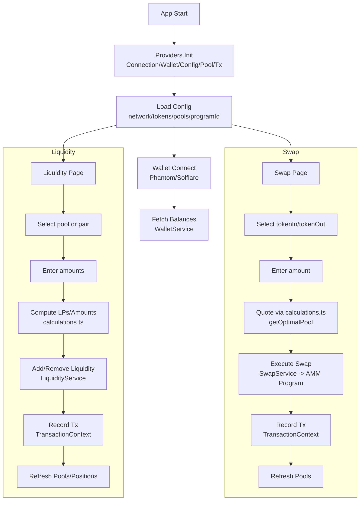

## Samm DEX Frontend – Architecture and Functional Overview

### Purpose
This document explains what the app uses for wallet connection, how pools/liquidity and swap workflows are implemented, key libraries, major modules, and the end‑to‑end flow. It targets Solana Devnet and talks to a custom AMM program via a configured `programId`.

### Tech Stack
- **Chain**: Solana (Devnet)
- **Core libraries**:
  - `@solana/web3.js`
  - `@solana/spl-token`
  - `@solana/wallet-adapter-react`, `@solana/wallet-adapter-react-ui`, `@solana/wallet-adapter-wallets`
  - React 19, Vite, Tailwind CSS
- **Routing**: `react-router-dom`
- **State/contexts**: Custom React Context providers (`ConfigContext`, `PoolContext`, `TransactionContext`)

### Network and Program Configuration
- Source: `src/config/poolConfig.ts`
- **Network**: `devnet`
- **RPC**: `https://api.devnet.solana.com`
- **Program ID** (custom AMM): `SwapsVeCiPHMUAtzQWZw7RjsKjgCjhwU55QGu4U1Szw`
- **Tokens**: Predefined token list (USDC, SOL, USDT, ETH) with mints and decimals
- **Pools**: Predefined set of pools; pool metadata informs quoting and selection
- **SAMM Router API**: Backend service for dynamic shard routing (`http://saigreen.cloud:3000`)
  - Provides intelligent shard selection based on real-time pool states
  - Configurable via `NEXT_PUBLIC_SAMM_ROUTER_API_URL` environment variable
  - Falls back to local routing if unavailable

### Wallet Connection
- Providers configured in `src/App.tsx`:
  - `ConnectionProvider` (endpoint to Devnet)
  - `WalletProvider` with `autoConnect`
  - `WalletModalProvider`
- Supported adapters instantiated: `PhantomWalletAdapter`, `SolflareWalletAdapter`
- UI component `src/components/wallet/WalletButton.tsx`:
  - Uses `useWallet()` to list/select/disconnect wallets
  - Filters to show Phantom, Solflare, and Backpack in the modal (Backpack appears in UI filter even if not instantiated; can be added similarly if desired)
- Balances: `src/components/wallet/WalletBalance.tsx` delegates to `WalletService` to fetch SPL token balances for the configured token list

### Configuration and Contexts
- `ConfigContext` (`src/contexts/ConfigContext.tsx`):
  - Exposes network metadata, `programId`, tokens, and helper functions like `getPoolsByPair`
- `PoolContext` (`src/contexts/PoolContext.tsx`):
  - Holds pools state, `refreshPools()` to rehydrate pool data
  - `getOptimalPool(tokenA, tokenB, amount)` returns the best pool for a swap
- `TransactionContext` (`src/contexts/TransactionContext.tsx`):
  - Records submitted transactions (swap and liquidity) for display in history

### Services (Chain Interaction)
- `WalletService` (`src/services/walletService.ts`):
  - Reads SPL token accounts and balances for a wallet
- `PoolService` (`src/services/poolService.ts`):
  - Fetches/derives on-chain pool data as needed (reserves, LP supply)
- `SwapService` (`src/services/swapService.ts`):
  - Local quoting (constant product AMM) and building a swap `TransactionInstruction` for the configured AMM `programId`
  - Sends and confirms the transaction via `@solana/web3.js`
- `LiquidityService` (`src/services/liquidityService.ts`):
  - Computes add/remove liquidity amounts and LP shares
  - Builds add/remove liquidity `TransactionInstruction`s and submits transactions
- `SammRouterService` (`src/services/sammRouterService.ts`):
  - Communicates with the SAMM Router backend API for dynamic shard selection
  - Provides intelligent routing based on real-time pool analysis
  - Includes health check and timeout handling (5-second timeout)
  - Falls back to local routing on API failure

### Hooks (UI Logic and Orchestration)
- `useSwap` (`src/hooks/useSwap.ts`):
  - Tracks swap state: selected tokens, input amount, quoted output, slippage, price impact, balances
  - On input change, computes output using `calculateSwapOutput` and selects the optimal pool via `PoolContext`
  - On submit, calls `SwapService.executeSwap(...)`, records tx in `TransactionContext`, and refreshes pools
- `useLiquidity` (`src/hooks/useLiquidity.ts`):
  - Tracks liquidity state: mode (add/remove), tokens/pool, amounts, expected LP tokens, balances, user positions
  - Computes expected LPs/amounts; on submit uses `LiquidityService.addLiquidity/removeLiquidity`, records tx, refreshes pools

### Math and Utilities
- `src/utils/calculations.ts`:
  - `calculateSwapOutput(...)`: Constant product x*y=k pricing with fee; returns output, fee, price impact
  - `calculateLiquidityAmounts(...)`, `calculateRemoveLiquidityAmounts(...)`: LP mint/burn math based on reserves and LP supply
- `src/utils/constants.ts`:
  - UI constants, default fees, error messages
- `src/utils/formatting.ts`:
  - Helpers for token amount parsing/formatting

### UI Composition and Pages
- Layout components: `src/components/layout`
- Swap UI: `src/components/swap/*` and page `src/pages/SwapPage.tsx`
- Liquidity UI: `src/components/liquidity/*` and page `src/pages/LiquidityPage.tsx`
- Pools list: `src/pages/PoolsPage.tsx`
- History: `src/pages/HistoryPage.tsx`
- Routes configured in `src/App.tsx`:
  - `/` Swap
  - `/liquidity` Liquidity
  - `/pools` Pools
  - `/history` History

### What It Uses for Swap/Pools/Liquidity
- **Not using a third‑party DEX SDK** (e.g., Orca/Raydium) in this repo
- Uses a **custom AMM program** (see `programId`) with client‑side services (`SwapService`, `LiquidityService`) that build program instructions directly
- Pool selection and quoting use **hybrid routing**:
  - **Primary**: Backend API routing via SAMM Router (analyzes real-time pool states across all shards)
  - **Fallback**: Local deterministic math + pool data (used when backend is unavailable)
- The system automatically falls back to local routing if the backend API is unreachable or returns errors

### “Pattuku” Clarification
There is no integration named “Pattuku” in this codebase. If you meant a specific protocol or SDK, it’s not present. The app speaks to the configured AMM `programId` on Solana Devnet.

### End‑to‑End Flow (Narrative)
1. App bootstraps providers in `src/App.tsx` (Connection, Wallet, Config, Pool, Transaction)
2. Tokens and pools are loaded from `poolConfig`; `PoolContext` hydrates pool data
3. User connects wallet (Phantom/Solflare); balances are fetched for configured tokens
4. Swap flow:
   - User selects tokenIn/tokenOut and enters amount
   - Hook computes output, fee, and price impact via constant product math and selects optimal pool
   - On swap, `SwapService` builds instruction for AMM `programId`, signs with wallet, sends, confirms, records tx, refreshes pools
5. Liquidity flow:
   - User selects pair/pool and amount(s)
   - Hook computes expected LPs or withdrawal amounts
   - On add/remove, `LiquidityService` builds, signs, sends, confirms, records tx, refreshes pools and positions

### Flow Diagram (Mermaid)

### Key Files and Where to Look
- Entry/Providers: `src/App.tsx`
- Config: `src/config/poolConfig.ts`, `src/contexts/ConfigContext.tsx`
- Pools: `src/contexts/PoolContext.tsx`, `src/services/poolService.ts`
- Swap: `src/hooks/useSwap.ts`, `src/services/swapService.ts`, `src/components/swap/*`
- Liquidity: `src/hooks/useLiquidity.ts`, `src/services/liquidityService.ts`, `src/components/liquidity/*`
- Wallet: `src/components/wallet/WalletButton.tsx`, `src/components/wallet/WalletBalance.tsx`, `src/services/walletService.ts`
- Transactions: `src/contexts/TransactionContext.tsx`, `src/services/transactionService.ts`

### Environment Variables
The application uses the following environment variables (configured in `.env.local` and `.env.example`):

#### Solana Network Configuration
- `NEXT_PUBLIC_SOLANA_RPC_URL`: Primary RPC endpoint (default: `https://api.devnet.solana.com`)
- `NEXT_PUBLIC_SOLANA_NETWORK`: Network identifier (default: `devnet`)
- `NEXT_PUBLIC_SOLANA_RPC_MAINNET`: Mainnet RPC endpoint for fallback
- `NEXT_PUBLIC_SOLANA_RPC_DEVNET`: Devnet RPC endpoint for fallback
- `NEXT_PUBLIC_SOLANA_RPC_TESTNET`: Testnet RPC endpoint for fallback

#### DEX Configuration
- `NEXT_PUBLIC_DEX_PROGRAM_ID`: Custom AMM program ID on Solana
- `NEXT_PUBLIC_DEX_PAYER`: Payer account for DEX operations

#### API Endpoints
- `NEXT_PUBLIC_JUPITER_API_URL`: Jupiter aggregator API for swap quotes (default: `https://quote-api.jup.ag/v6`)
- `NEXT_PUBLIC_SAMM_ROUTER_API_URL`: SAMM Router backend API for dynamic shard routing (default: `http://saigreen.cloud:3000`)
  - Used for intelligent shard selection based on real-time pool analysis
  - System automatically falls back to local routing if unavailable
  - Timeout: 5 seconds per request

### Operational Notes
- Default endpoint and program target Devnet; to change, update `src/config/poolConfig.ts`
- To add another wallet (e.g., Backpack), instantiate its adapter in `src/App.tsx` and optionally update `WalletButton` filter
- Pool definitions drive quoting and selection; ensure on-chain pool metadata matches config
- SAMM Router API can be disabled by removing or commenting out `NEXT_PUBLIC_SAMM_ROUTER_API_URL`; the system will use local routing exclusively

### Limitations and Assumptions
- Assumes constant product AMM mechanics
- No aggregated routing across multiple pools; single "optimal" pool selection per swap
- No external price oracles; all pricing is pool‑based
- No “Pattuku”/external protocol SDKs are integrated in this repository

